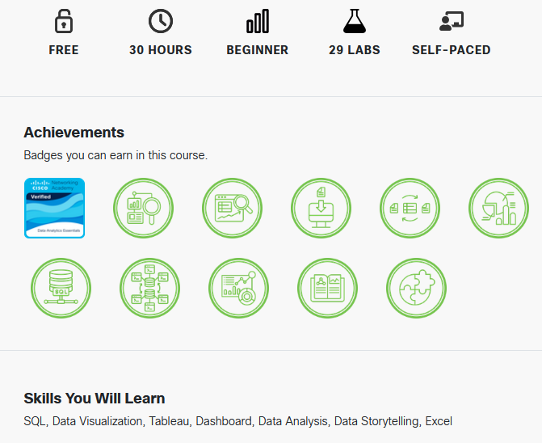

# [Cisco Data Analitics](https://www.netacad.com/courses/data-analytics-essentials?courseLang=en-US)
### Практические задания (выборочно)

#### Описание курса
`Этот курс по основам анализа данных познакомит вас с основными инструментами аналитика данных. Вы научитесь преобразовывать, систематизировать и визуализировать данные с помощью электронных таблиц, таких как Excel. Вы также узнаете, как запрашивать данные из реляционной базы данных с помощью SQL и как улучшить представление данных с помощью мощных инструментов бизнес-аналитики, таких как Tableau. К концу курса у вас будет аналитическое портфолио, включающее анализ набора данных о популярных фильмах, демонстрирующее ваши навыки работы с Excel, SQL и Tableau.`

#### [Программа курса](https://www.netacad.com/courses/data-analytics-essentials?courseLang=en-US):
1. Module 1: Data Analytics Projects
2. Module 2: Getting started with Data Gathering and Investigation
3. [Module 3: Preparing and Cleaning Data for Analysis](https://github.com/bekasDS/CiscoDataAnalitics/tree/main/Module_3_Preparing_and_Cleaning_Data_for_Analysis/3.4._Data_Preparation/3.4.6_Lab-Preparing_Data)
4. [Module 4: Transforming Data with Excel](https://github.com/bekasDS/CiscoDataAnalitics/tree/main/Module_4_Transforming_Data_with_Excel)
5. [Module 5: Analyze the Data Using Statistics](https://github.com/bekasDS/CiscoDataAnalitics/tree/main/Module_5_Analyze_the_Data_Using_Statistics)
6. Module 6: Introduction to Relational Databases and SQL
7. Module 7: Introduction to Structured Queries
8. Module 8: Introduction to Tableau
9. Module 9: Ethics and Bias in Data
10. Module 10: Take the Next Steps
11. Data Analytics Essentials Final Exam

##### Примечание
1. Выполнение практических заданий курса на английском языке разделено:
   1. на платформе Cisco или других (например, _Tableu, MS 365_),
   2. на компьютере студента (обработка _raw data, SQL, csv, xslx_).
2. Выложены некоторые из решений различной сложности, доступные для публикации.
3. В некоторых заданиях выполнены операций над данными, загруженными из сторонних источников (например, csv).
4. По техническим причинам, связанным с оформлением Заданий на портале Cisco, часть заданий публикуется без условий задачи.
5. Отсутствуют Задания визуализации данных Tableu.
6. В каждом модуле курса были тесты по пройденым темам.
